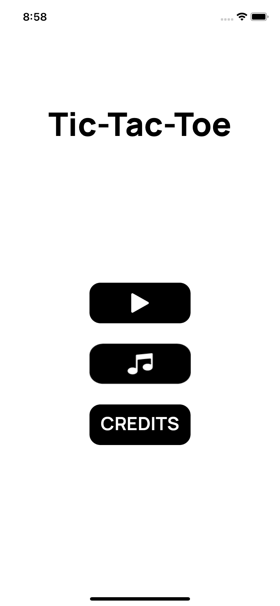
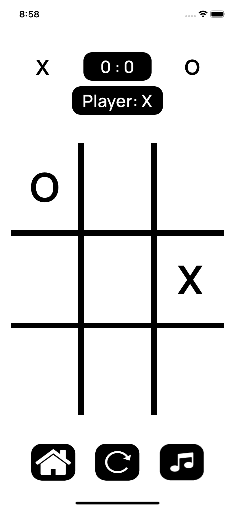
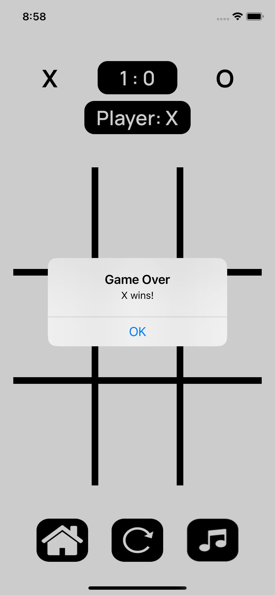
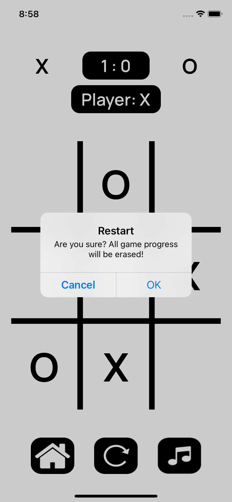
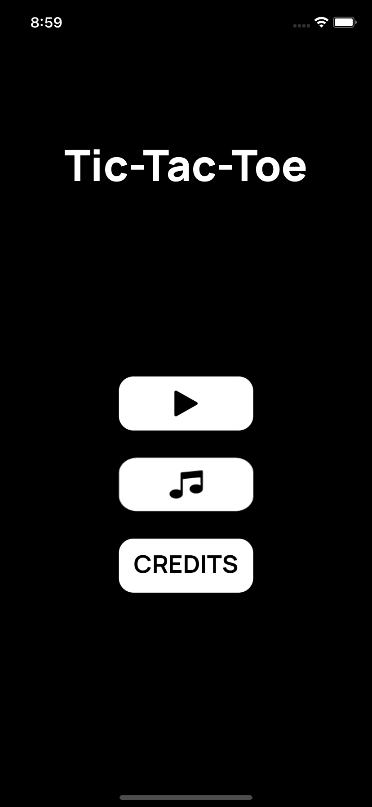
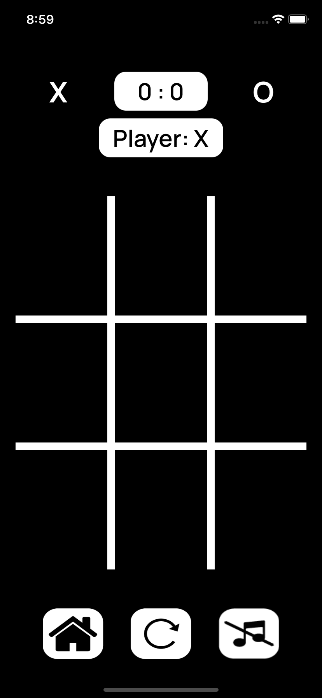

# Tic-Tac-Toe

A simple and fun Tic-Tac-Toe game built using Swift and UIKit framework. 100% programmatically (except Launch Srceen)

## Features

- Play against a friend locally.
- Simple and intuitive user interface.
- Restart the game anytime.
- Adapt to dark mode.
- Keeps track of the current player and game status.
- Music toggle functionality.

## Screenshots

## Requirements

- iOS 14.0+
- Xcode 11+
- Swift 5.0+
